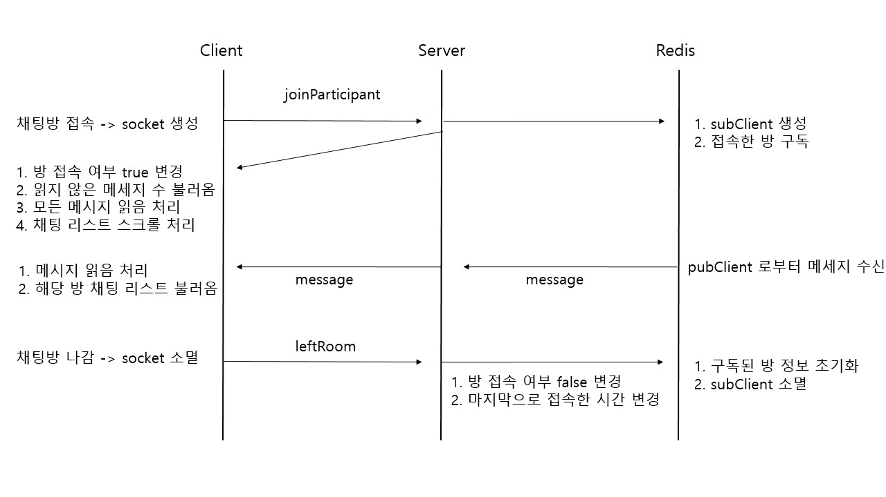

# hungry-chat-node

Back-end : Node API Server ( chat )

## 1. Environment

- Java : 8~11 version
- Node : 14 version
- MySQL 설치
- Redis 설치

## 2. 실행 방법

```powershell
# 설치 (의존 모듈 설치)
npm i

# 실행
npm start

# 테스트
npm run test

# 개발시
npm run debug
```

## 3. 구조 (Architecture)

- 대부분의 API : index.js → routes → controllers → models
- 일부 API : index.js → routes → services → repository → models

```
hungry-chat-node
   |--- package.json          [project info]
   |--- package-lock.json     [module info]
   |--- redis.js              [redis 사용하기 편하게 하기 위해 만든 모듈]
   |--- redis-conf.js         [redis 설정 정보]
   |--- app.config.env        [mysql 설정 및 여러 설정 정보]
   |--- index.js              [express && socket && redis]
   |--- /public               [정적 자원 모음; 파일 저장소]
   |--- /logging              [error, info등 로깅]
   |--- /docs                 [sql과 model 저장]
   |--- /test                 [mysql 테스트; mocha]
   |--- /swagger              [API 문서화]
   |--- /utils                [user,participant,unknown등 소켓 사용시 사용하기 편한 모듈]
   |--- /routes               [URL 및 http method(get,post)등의 클라이언트 요청에 따른 응답하는 방법 결정]
   |        |--- index.js     
   |        |--- chat.js      [chat API routing; authorized로 권한 분리 및 token 확인 후 해당 controller로 보냄]
   |        |--- authorized.js[권한 분리 및 token 확인]
   |        |--- jwt.js       [token decoding]
   |        |--- error.js     [404, 500 error json code]
   |--- /controllers          [API 실제 동작(콜백함수)]
   |--- /models               [sequelize 연결]
   |--- /services             [비즈니스 로직에 따른 코드]
   |--- /repository           [model 연결 관련 코드]
```

## 4. 채팅 로직


    


## 5. API

* Swagger 사용 : [http://localhost:9999/swagger/](http://localhost:9999/swagger/)


## 6. 이슈사항

- [sequelize 1:N 연결인 경우 foreign key 설정](https://velog.io/@mong-head/Node-Sequelize-foreign-key-%EC%84%A4%EC%A0%95)
